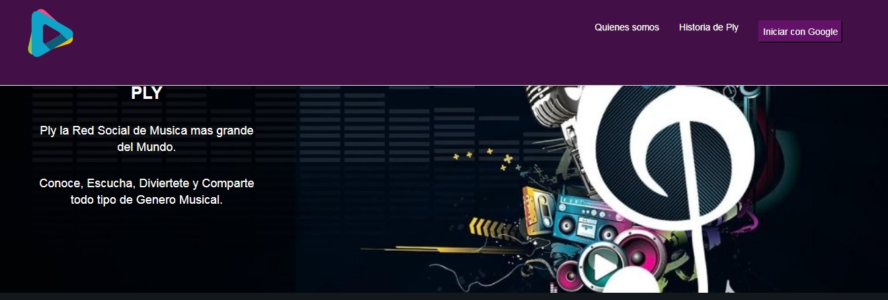
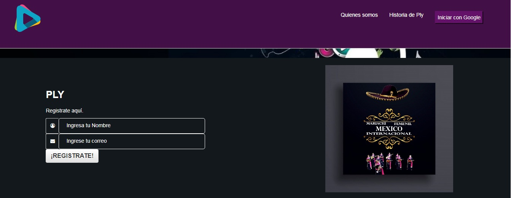
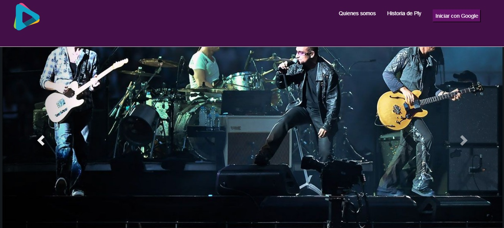
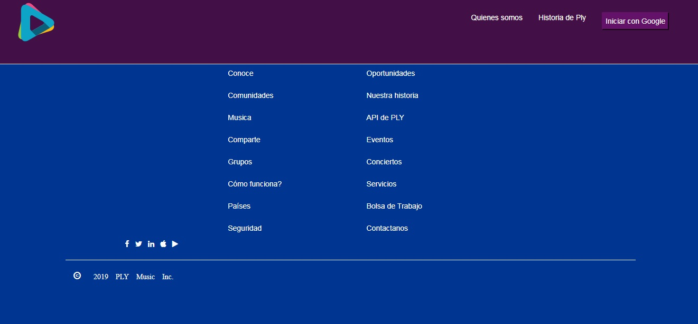
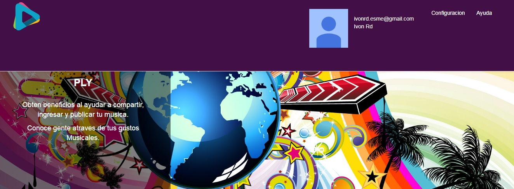
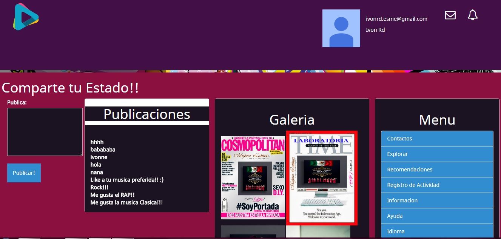
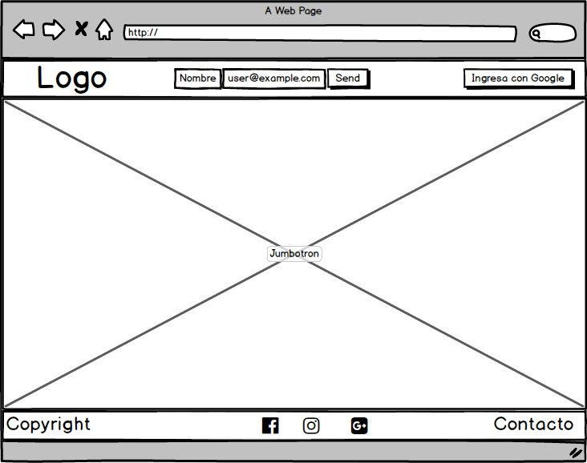
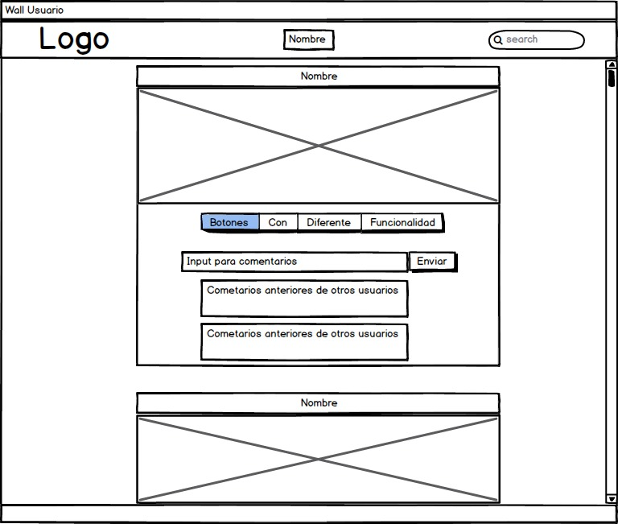
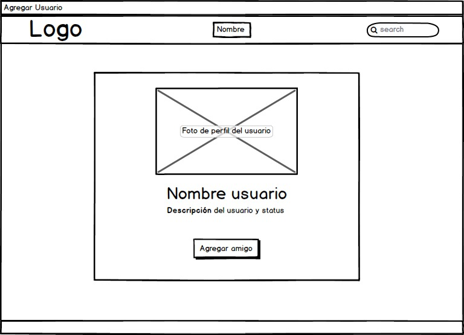

# PLY
***

## Flujo de trabajo: Con una problemática de buscar un espacio donde los músicos pudieran tener un lugar exclusivo de encuentro, entre quienes  son músicos y quienes requieren un servicio dentro de la misma área.

1. Identificamos el problema.

2. Descubrir cuáles son los interes generales del grupo objetivo.

3. Elaboración de un check list con los lineamientos y alcances del proyecto.

4. Identificar los componentes que podían resolver con más aceptación la problemática del target.

## Objetivo

El reto consiste en desarrollar una solución digital, una red social, donde puedan compartir e interactuar los músicos:

## Detalles adicionales

Para el proceso del desarrollo de la idea se utilizó la técnica de Desing Thinking

1. Empatizar (Observar - Involucarnos -Escuchar)

2. Definir (Organizamos la información para determinar el problema para enfocarlo y determinar el éxito del proyecto Point Of View POV)

3. Idea (brainstorming)

4. Prototipamos (Elaboramos los bocetos de la idea

5. Probar (Evaluamos con el usuario si la solución presentada cumplia su objetivo).  

## Consideraciones generales

Este reto se utilizaron las siguientes herramientas, materiales y fuentes:

- Trello para administra el proyecto y la definición de objetivos.
- Investigaciones de INEGI para conocer a la población objetivo.
- Articulos diversos para conocer más sobre nuestro target.
